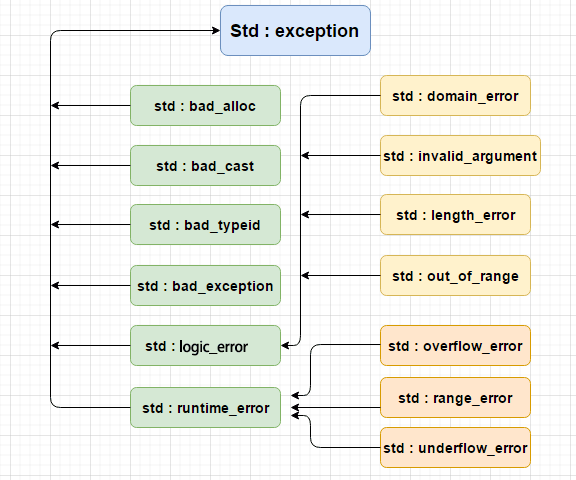

# 《Essential c++》——第七章
---

### 异常处理机制
> 为了保证程序具有一定的容错能力，在出现意外的情况下不至于出现灾难性的后果，因此在程序中最好要考虑各种意外，并给出处理方法。

c++异常处理机制：
- 异常的鉴定与发出（try，throw）
- 异常的处理方式（catch）

异常机制的过程：
- 异常出现之后，正常的程序被暂停；
- 与此同时，异常处理机制开始搜索程序中有能力处理这个异常的地点；
- 异常处理完成之后，程序的执行便被继续。

**异常（exception）是某种对象**，最简单的异常对象可以设计为整数或者字符串。但是大部分时候，被throw的异常属于特定的**异常类**
```c++
throw 422;
throw "there is an error!"
```

C++ 提供了一系列标准的异常，定义在 <exception> 中，我们可以在程序中使用这些标准的异常。



### 异常处理（[代码展示](../code/essential/exception.cpp)）

- 设计异常的基本思想：
让一个函数在出现了自己无法处理的错误时，抛出（throw）一个异常，然后它的调用者能够处理这些问题。

> 也就是说，如果在一个函数内部发生了某种错误，但是它没有能力去处理这个错误，于是这个函数能做的就是throw出来。然后这个函数的执行就被暂停，此时，c++的 异常处理机制开始查看它的调用者，在调用者中搜索类型吻合的catch语句。

但是当在整个main（）中都没有吻合的catch语句时，会调用标准库提供的`terminate()`函数，中断整个程序的执行。


 C++之父Bjarne Stroustrup在《The C++ Programming Language》中讲到：
 > 一个库的作者可以检测出发生了运行时错误，但一般不知道怎样去处理它们（因为和用户具体的应用有关）；另一方面，库的用户知道怎样处理这些错误，但却无法检查它们何时发生（如果能检测，就可以再用户的代码里处理了，不用留给库去发现）。

也就是《C++ primer》中说的：**将问题检测和问题处理相分离。**

具体可以查看本节的代码展示。
程序抛出异常之后进行处理，然后继续执行剩下的代码。

**注意**：
- try后面可以跟着多条catch语句进行不同异常类型的处理。异常对象的类型会被拿来逐一的和每个catch语句比较，如果类型符合，那么该catch语句的内容就会被执行。
- 但是catch语句的参数必须和throw后面的参数类型一致，不然将无法正常捕获程序抛出的异常。
- 如果异常在try语句之前就已经产生，那么后面的try语句块将不在执行，

如果想要捕获任何类型的异常，在catch中使用省略号即可：
```c++
catch(...)
    //...
```

### 面向对象的异常处理
C++可以在一个类A中定义一个内隐类B，也叫嵌套类，作为类A函数成员出现异常时的输出对象。
此时，可以根据内隐类B保存导致异常的信息。但是内隐类的作用域就是封装它的那个类，一旦超出这个范围，内隐类将失效。

考虑如下程序：
```c++
#include <iostream>
using namespace std;
class Devide
{
private:
    int lower;
    int upper;
    int input;
public:
    //定义内隐类
    class RangeOut
    {
    public:
        int val;
        //构造函数，保存异常时的数据
        RangeOut(int a){val = a;}
    };
    Devide(int l,int u){lower = l;upper = u;}
    //获取用户输入并判断是否超出范围
    int getInput(void)
    {
        cin>>input;
        if(input < lower || input > upper)
            throw RangeOut(input);
        return input;
    }
};

int main()
{
    Devide first(1,10);
    int useVal;
    cout << "pleae input a num range from 1 to 10:" << endl;
    try
    {
        useVal = first.getInput();
        cout<<"the num you input is:"<<useVal<<endl;
    }
    catch(Devide::RangeOut ex)
    {
        //catch内部就是用户处理异常的代码
        cout<<"the num "<<ex.val<<" out of range\n\n";
    }
    cout<<"end of the program\n\n";
    return 0;
}
```
在上面的例子中，一旦用户输入的数据超出既定的范围，函数就会抛出异常，但是这个异常是一个内隐类的对象，并使用导致异常的这个值初始化内隐类。
然后在用户的catch语句中利用刚刚的内隐类输出这个异常值。

**注意**：
- 一旦程序抛出异常，在执行了异常处理程序之后，程序再也不能回到抛出点继续执行，因为c++采用的是不可恢复发异常处理模型。
- 一旦程序抛出异常，执行throw语句的函数也将立即停止执行，如果该函数被别的函数调用，那么调用者也立即停止。
- 如果是对象的函数成员抛出的异常，那么立即对该对象调用析构函数。
- 如果try语句中创建有对象，但是在函数抛出异常时，这些对象还未来得及析构，那么立即调用这些对象的析构函数。

### 异常的再次抛出
```c++
try{
    doSomething();
}catch(exception1){
    //处理异常1的代码
}catch(exception2){
    //处理异常2的代码
}
//该函数不能处理异常1，将再次抛出异常给它的调用者继续执行
void doSomething()
{
    try{
        doElse()
    }catch(exception1){
        throw;  //再次抛出异常
    }catch(exception3){
        //处理异常3的代码
    }
}
```
这种嵌套的try块适合处理内部的异常处理者传递给外部的异常处理者的异常对象。

### 局部资源管理
在异常处理机制终结某个函数之前，c++保证，函数中的所有局部对象的destructor都会被调用。

- `auto_ptr` 是标准库提供的class template，它会自动删除通过new表达式分配的对象。并且可以像使用一般指针一样使用auto_ptr的对象。

```c++
#include <memory>

// 使用auto_ptr定义一个对象
auto_ptr<string> aps(new string("andrew"));
string *ps = new string("hello");
if(aps->size() == ps->size()) {
    //...
}
```


### 标准异常（[代码展示](../code/essential/exception.cpp)）
以下语句
```c++
ptext = new vector<string>
```
会分配足够的内存，然后将 `vector<string>` 的默认构造函数作用于heap对象之上，然后再将对象地址设置给ptext。
此时如果new表达式无法从程序的空闲空间中分配到足够的内存，它会抛出 `bad_alloc`异常对象。

> 标准库中定义了一整套的异常体系，也就是笔记开始的那一张图。其根部是一个 `excepting` 的**抽象基类**。

exception 声明了一个`what()`虚函数，会返回一个 `const char*`，用来表示被抛出异常的问题描述。

本节的代码展示中，使用一个自定义的异常类，让其继承于exception，从而自己的代码也融入了标准的异常类体系，
然后实现自己的what函数。

**[部分代码]**
```c++
// 自定义异常类，继承标准异常
class outRange : public exception {
    public:
    outRange(int index, int max):_index(index),_max(max){

    }
    int index() {return _index;}
    int max() {return _max;}
    
    // 覆盖抽象基类中的虚函数，用来输出异常信息
    const char* what();

    private:
    int _index;
    int _max;
};

const char* outRange::what() {
    ostringstream ex_msg;
    static string msg;
    ex_msg << "The num you input out of range: "
            << _index << " exceeds maximum bound: "
            << _max;
    // 萃取出string对象
    msg = ex_msg.str();
    // 萃取出 const char* 表达式
    return msg.c_str();
}
```
